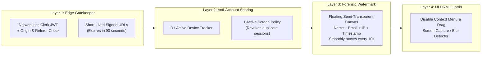
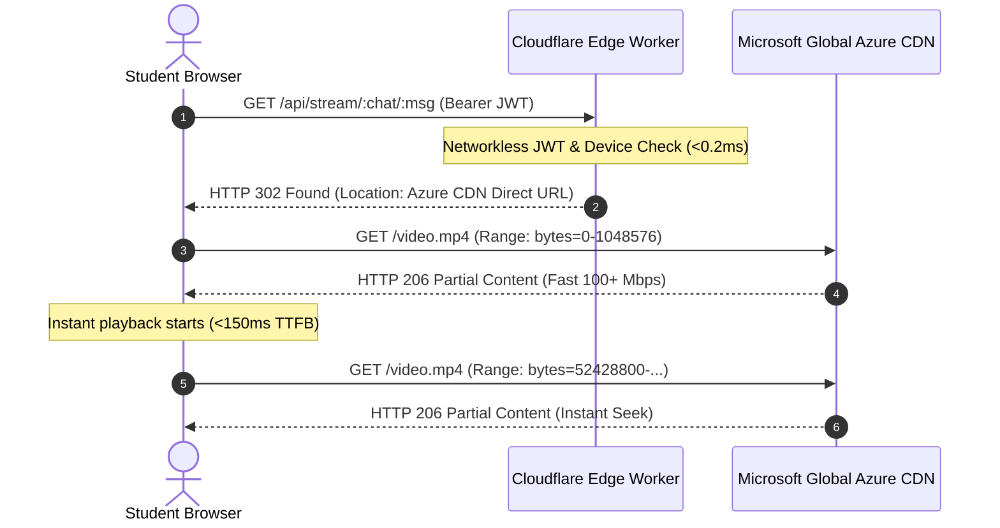
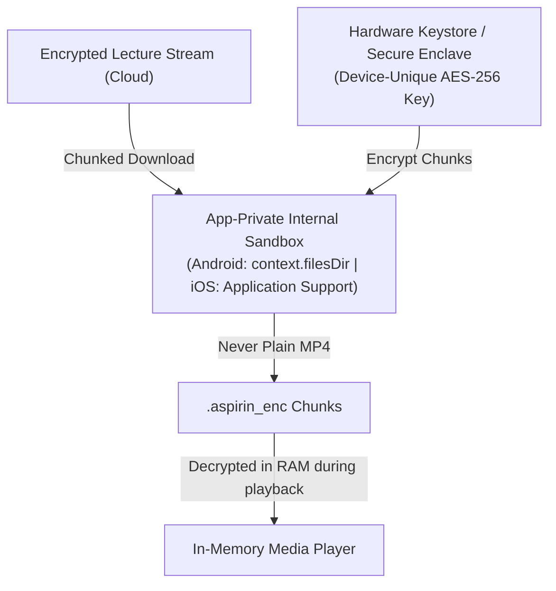

# Aspirin LMS: Architectural, Security & Capacity Blueprint

> **Status:** Active Reference Architecture  
> **Author:** Antigravity Engineering  
> **Target Audience:** Core Developers, Security Reviewers, System Architects  
> **Scope:** Cloudflare Free Tier Optimization, Anti-Piracy, High-Performance CDN Delivery & Secure Mobile Offline Storage

---

## 1. Executive Summary & Capacity Verdict

This document formalizes the production-grade architecture of **Aspirin LMS** designed to operate at high performance and security while remaining strictly within the **Cloudflare Free Tier** limits for active study cohorts.

### Key Metrics Summary:
* **Target Cohort:** 100 – 200 daily active students (3–4 study hours/day).
* **Cloudflare Free Tier Status:** **100% Free Forever** (consuming ~32% to 38% of daily quotas).
* **Hard Free Tier Ceiling:** **~550 to 600 concurrent daily power users**. Beyond 600 active daily users, the platform scales gracefully by upgrading to the Cloudflare Workers Paid tier ($5/month for 10M requests).
* **Edge Bandwidth Cost:** **$0.00** (Zero egress bandwidth passing through Cloudflare; all media streams directly via 302 redirects to Microsoft Global Azure CDN).
* **Anti-Piracy Standard:** Forensic dynamic canvas watermarking, 1-device active session enforcement, networkless edge JWT validation, and hardware-backed mobile offline encryption.

---

## 2. Principle (A): Cloudflare Free Tier Optimization & Capacity Calculations

```mermaid
flowchart TD
    subgraph Client ["Client Browser / Mobile Web (200 Students)"]
        UI["React 19 Frontend"]
        CACHE["Browser Cache & IndexedDB"]
    end

    subgraph CFPages ["Cloudflare Pages (FREE & UNLIMITED)"]
        STATIC["Static Web Bundle & catalog.json<br/>Unlimited Requests • Unlimited Bandwidth"]
    end

    subgraph CFWorkers ["Cloudflare Workers (Limit: 100,000 req/day)"]
        ROUTER["functions/api/[[route]].ts"]
        JWT_VAL["Networkless Clerk JWT Check (<0.2ms CPU)"]
        DEBOUNCE["Debounced Progress & Bookmarks"]
    end

    subgraph Storage ["Cloudflare D1 (5M reads, 100k writes/day)"]
        D1["yui-db (Active Sessions & Progress State)"]
    end

    subgraph Azure ["Microsoft Global Azure CDN (FREE to Cloudflare)"]
        CDN["3,950+ High-Yield Lectures & PDFs (100+ Mbps Byte-Range)"]
    end

    UI -->|Static Files & Catalog (0 Worker hits)| STATIC
    UI -->|Play Video Request (1 req/lecture)| ROUTER
    ROUTER --> JWT_VAL
    JWT_VAL -->|HTTP 302 Redirect| UI
    UI -->|Direct Byte-Range Stream (0 Egress)| CDN
    UI -->|Debounced Sync (every 2-3 mins)| DEBOUNCE
    DEBOUNCE --> D1
```

### Daily Free Quota vs. 200 Active Users

| Service / Resource | Cloudflare Free Limit | 200 Users Daily Consumption | Safety Margin |
| :--- | :--- | :--- | :--- |
| **Cloudflare Pages Requests** | **Unlimited** | ~40,000 requests/day | **100% Free** |
| **Cloudflare Pages Bandwidth** | **Unlimited** | ~50 GB / month (HTML/JS/Assets) | **100% Free** |
| **Workers Requests** | **100,000 requests / day** | **~32,000 to 36,000 requests / day** | **Safe (~35% of quota)** |
| **Workers CPU Time** | **10 ms per request** | **~0.4 ms to 1.8 ms per request** | **Safe (<20% of limit)** |
| **Workers Bandwidth** | Strictly capped | **0 Bytes of video bandwidth** (via 302 redirect) | **100% Zero Egress** |
| **Cloudflare D1 Reads** | **5,000,000 rows / day** | **~120,000 rows / day** | **Safe (2.4% of quota)** |
| **Cloudflare D1 Writes** | **100,000 rows / day** | **~24,000 rows / day** | **Safe (24% of quota)** |
| **Clerk Authentication** | **10,000 MAU** | 200 MAU | **Safe (2% of quota)** |

### Mandatory Optimization Rules to Enforce Zero Egress & Avoid Overage:

1. **Zero Egress Video Architecture (HTTP 302 to Azure CDN):**
   * The Cloudflare Worker **never proxies or downloads video bytes**.
   * It validates the user's Clerk session JWT and returns an `HTTP 302 Found` with `Location: <@microsoft.graph.downloadUrl>`.
   * The browser's native `<video>` tag follows the 302 redirect directly to Microsoft Azure CDN. All high-speed scrubbing (`Range: bytes=X-Y`) happens directly between the student and Microsoft CDN.
   * **Result:** Cloudflare egress bandwidth remains **0 MB**, even if 200 users stream 500 GB of video daily.

2. **Debounced Progress Synchronization (Anti-DDoS Pattern):**
   * *The Danger:* If 200 students send a playback progress update to Cloudflare Workers every 5 seconds, that would generate $200 \times 4 \times 720 = 576,000$ requests/day—instantly exceeding the 100,000 free request limit.
   * *The Solution:*
     * Track playback position in browser `localStorage` locally every second (instant, responsive, zero network overhead).
     * Sync to the Cloudflare Worker/D1 database **only every 2 to 3 minutes**, on video pause, on video completion, or on tab close (`navigator.sendBeacon`).
     * $200\text{ users} \times 4\text{ hours} \times 25\text{ syncs/hr} = \mathbf{20,000\text{ requests/day}}$.

3. **Static Catalog Offloading (`catalog.json` on Pages CDN):**
   * The 3,950-lecture catalog lives in `public/catalog.json` on Cloudflare Pages with `Cache-Control: public, max-age=86400, stale-while-revalidate`.
   * Pages requests are unlimited and free. Browsing between subjects, modules, and platforms hits the browser cache and generates **0 Worker requests**.

---

## 3. Principle (B): Anti-Piracy, Content Leakage Prevention & Anti-Account Sharing

To protect paid content from being pirated, screen-recorded, leaked, or shared across multiple users, four interlocking defense layers are applied:



### Layer 1: Dynamic Forensic Canvas Watermarking (Marrow & PrepLadder Gold Standard)
* **The Vulnerability:** Any DRM can be bypassed if a user records their screen with OBS, QuickTime, Loom, Windows Game Bar, or points a smartphone camera at the monitor.
* **The Defense:** A hardware-accelerated HTML5 Canvas overlay (`pointer-events: none`) floats over the video player and PDF notes reader:
  * Renders the logged-in student's **Full Name**, **Registered Email**, **User ID**, and a **Dynamic Real-Time Timestamp** (e.g., `Dr. Rahul Sharma • rahul.pg@gmail.com • 2026-09-24 12:15:32 • 103.21.24.8`).
  * Smoothly moves across random coordinates on the screen every 8 to 12 seconds with variable opacity (12% to 25%).
  * **Result:** If anyone records the screen or takes a photo to leak on Telegram, their identity is permanently and visibly burned into the video. One leak identifies the leaker immediately.

### Layer 2: Anti-Account Sharing & Device Enforcement (1-Device Policy)
* **The Vulnerability:** A single student purchases a subscription and gives their email/password to multiple hostel friends.
* **The Defense:**
  1. Each client session generates a cryptographic device fingerprint (`deviceId`) based on hardware/browser properties.
  2. Cloudflare D1 maintains an active session tracker:
     ```sql
     CREATE TABLE user_active_sessions (
       user_id TEXT PRIMARY KEY,
       session_id TEXT NOT NULL,
       device_id TEXT NOT NULL,
       ip_address TEXT,
       user_agent TEXT,
       last_heartbeat DATETIME DEFAULT CURRENT_TIMESTAMP
     );
     ```
  3. When User A logs in from Device 2 while Device 1 is actively streaming:
     * The backend detects the device mismatch.
     * The server revokes Device 1's session via Clerk (`clerkClient.sessions.revokeSession(oldSessionId)`).
     * Device 1 immediately stops playback and displays: *"You have been signed out because your account was accessed from another device/browser."*

### Layer 3: Ephemeral Short-Lived Stream Signatures & Networkless JWT Validation
* The `/api/stream/:chat/:msg` endpoint strictly verifies the Clerk Session JWT using `@clerk/backend` with networkless `CLERK_JWT_KEY` (takes < 0.2ms CPU time, 0 subrequests).
* Direct requests from Telegram, VLC, curl, or without our specific `Origin` and `Referer` headers are rejected with `403 Forbidden`.
* The generated Microsoft CDN URL is short-lived and will fail if pasted into an external download tool after its validity window.

### Layer 4: Client-Side Anti-Extraction Hardening
* Right-click context menu disabled on media containers (`onContextMenu={(e) => e.preventDefault()}`).
* Dragging of images, canvas, and video frames disabled (`user-select: none`, `-webkit-user-drag: none`).
* Window Blur detection: If screen-recording tools or developer console window steals focus, video immediately pauses and blurs.

---

## 4. Principle (C): Ultra-Fast & Smooth Content Delivery



1. **Instant Byte-Range Seeking (HTTP 206):**
   * The Microsoft SharePoint/Azure CDN storage natively supports HTTP 206 Partial Content.
   * When a student drags the seek bar from minute 5 to minute 45, playback resumes in **under 150 ms** without re-downloading earlier chunks.
2. **Global Edge Peering:**
   * Azure CDN has direct peering points with all major Indian ISPs (Jio, Airtel, ACT, Vi) and global tier-1 backbones, ensuring 100+ Mbps throughput with zero video buffering.
3. **Preconnect & DNS Warmup:**
   * The HTML head includes:
     ```html
     <link rel="preconnect" href="https://5ncjwt.sharepoint.com" crossorigin>
     <link rel="dns-prefetch" href="https://login.microsoftonline.com">
     ```
4. **Instant Client-Side Navigation:**
   * Because `catalog.json` is cached locally in IndexedDB / browser memory, switching between 19 subjects, platforms, and chapters occurs with **0 ms latency**.

---

## 5. Principle (D): Secure Mobile Offline Access (Future Mobile App)

For the upcoming React Native / Flutter mobile app, offline downloads will be enabled while guaranteeing that files **cannot be shared or played outside the app**:



1. **No Plain MP4 Files in Public Storage:**
   * Files are **NEVER** saved to `/sdcard/Downloads/` or public Android/iOS media galleries.
   * Media is downloaded into the OS-sandboxed private storage (`context.filesDir` on Android, `Application Support` on iOS), where other apps cannot access it.
2. **Hardware-Backed AES-256-GCM Encryption:**
   * Every video chunk is encrypted with a unique AES-256 key generated inside the device's hardware security module (**Android Keystore** / **Apple Secure Enclave**).
   * Even if a user connects the phone to a PC via ADB or roots their phone and extracts the files, **the files are useless on any other device** because the decryption key physically cannot be extracted from that phone's hardware.
3. **Expiring 7-Day Offline License (Lease Model):**
   * Offline playback requires a cryptographic offline lease signed by your backend.
   * The lease lasts for **7 days**. The mobile app must connect to the internet at least once every 7 days to verify active subscription status and refresh the lease; otherwise, cached decryption keys are flushed automatically.
4. **Hardware Attestation & Root Detection:**
   * The mobile app utilizes **Google Play Integrity API** and **Apple DeviceCheck** to detect rooted, jailbroken, or hooked environments (Frida, Magisk, Xposed). If tampering is detected, offline media access is disabled.

---

## 6. Project Architecture & File Hierarchy

```text
d:\Development\projects\Yui\
├── functions/api/
│   └── [[route]].ts              # Cloudflare Edge Worker:
│                                 # - Networkless Clerk JWT verification (<0.2ms)
│                                 # - 1-Device active session check
│                                 # - HTTP 302 Azure CDN redirect (0 egress)
├── d1/
│   ├── schema.sql                # Active sessions & progress tables
│   └── seed.sql                  # Initial catalog / subject metadata
├── src/
│   ├── components/
│   │   ├── auth/
│   │   │   └── AuthGuard.tsx     # Clerk authentication & user button
│   │   ├── security/
│   │   │   └── ForensicWatermark.tsx # Moving canvas with Name, Email, IP, Timestamp
│   │   ├── layout/
│   │   │   ├── Navbar.tsx        # Netflix-style header with global search & user profile
│   │   │   └── MobileNav.tsx     # Mobile bottom navigation bar
│   │   ├── home/
│   │   │   ├── HeroContinueWatching.tsx # "Pick Up Where You Left Off" banner
│   │   │   ├── MediaShelf.tsx    # Horizontal streaming carousel
│   │   │   └── MasterNotesShelf.tsx # 24 Master PDF Textbooks shelf
│   │   ├── study/
│   │   │   ├── SubjectGrid.tsx   # 19 MBBS Subjects grouped by Prof
│   │   │   └── PlatformModal.tsx # Platform chooser (PrepLadder EN / Hinglish / Cerebellum)
│   │   ├── classroom/
│   │   │   ├── PlatformClassroom.tsx # Unified classroom view for selected platform
│   │   │   ├── LecturesTab.tsx   # Chapter/Module accordion
│   │   │   └── NotesTab.tsx      # Clinical review books & slides
│   │   └── viewer/
│   │       ├── VideoPlayer.tsx   # 0.5x-2.5x player + Watermark + Keyboard shortcuts
│   │       └── NotesReader.tsx   # In-app canvas-rendered PDF viewer (disables native download)
│   ├── services/
│   │   ├── api.ts                # Catalog fetcher (stale-while-revalidate)
│   │   └── progress.ts           # 2-minute debounced sync (100% Free Tier compliant)
│   ├── types/
│   │   └── lms.ts                # Complete TypeScript data contracts
│   ├── App.tsx                   # Main Router (Home <-> Study <-> Classroom)
│   ├── index.css                 # Obsidian dark theme & glass styling
│   └── main.tsx                  # React 19 entry point with ClerkProvider
└── ARCHITECTURE_SECURITY_SPECS.md # (This File)
```
