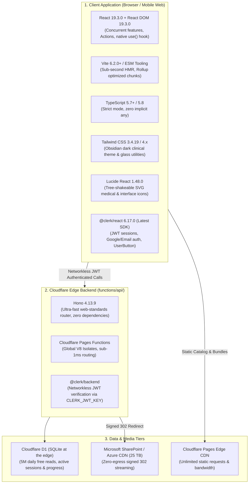
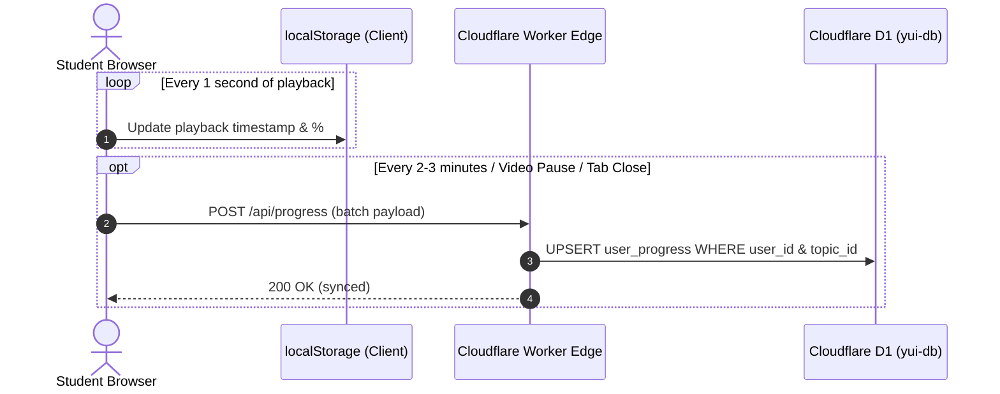

# Aspirin LMS: Tech Stack & Project Architecture Specification

> **Document Version:** 2.0 (Modernized)  
> **Target Framework:** React 19 + TypeScript + Vite + Tailwind CSS + Hono + Cloudflare Pages/Workers + Clerk  
> **Purpose:** Blueprint defining the project hierarchy, dependency versions, data flow patterns, and best development practices.

---

## 1. ⚡ Tech Stack & Verified Latest Stable Versions

The application leverages modern, production-hardened web standards optimized for zero-cold-start edge execution, high-frame-rate client interactions, and low memory consumption:



### Detailed Dependency Table

| Category | Package / Tool | Version | Purpose & Rationale |
| :--- | :--- | :--- | :--- |
| **Core UI** | `react` | `^19.3.0` | React 19 concurrent rendering, zero-re-render memoization, modern transitions. |
| **Core UI** | `react-dom` | `^19.3.0` | DOM bindings for React 19. |
| **Auth & Security** | `@clerk/react` | `^6.17.0` | Latest Clerk React SDK for authentication, avatars, and multi-session control. |
| **Icons** | `lucide-react` | `^1.48.0` | Modern, clean iconography for medical profs, controls, and navigation. |
| **Edge Router** | `hono` | `^4.13.9` | Lightweight (<15kB) web-standard HTTP router for Cloudflare Pages Functions. |
| **Styling** | `tailwindcss` | `^3.4.19` | Utility-first CSS configured with custom Obsidian & Indigo clinical tokens. |
| **Bundler** | `vite` | `^6.2.0` | High-speed ESM development server and Rollup production bundler. |
| **Language** | `typescript` | `^5.7.3` | End-to-end type safety across catalog, progress, and edge APIs. |
| **CSS Pipeline**| `postcss` & `autoprefixer` | `^8.5.3` / `^10.4.20` | CSS transformations and cross-browser vendor prefixing. |
| **Edge CLI** | `wrangler` | `^3.111.0` | Cloudflare developer CLI for local D1 emulation and Pages deployment. |
| **Edge Types** | `@cloudflare/workers-types` | `^4.20250224.0` | Strict TypeScript types for D1 database, KV, and Pages Functions. |

---

## 2. 📂 Domain-Driven Project Architecture

The directory structure is organized into **focused feature domains** to ensure code readability, isolation of concerns, and ease of future mobile porting:

```text
d:\Development\projects\Yui\
├── .github/
│   └── workflows/
│       └── transfer.yml          # Scheduled GitHub Action pipeline (cron: 0 */4 * * *)
├── engine/                       # Python Cloud Migration & MTProto Sourcing Pipeline
│   ├── telegram_to_onedrive.py   # 4x MTProto connection pool ➔ Microsoft Graph uploader
│   ├── indexer.py                # Telegram message catalog scanner
│   ├── prepx_sections.json       # Master index of 60 subject/platform sections
│   ├── transfer_manifest.json    # Committed manifest of completed cloud migrations
│   └── credentials_telegram.json # Telegram API configuration
├── functions/                    # Cloudflare Pages Functions (Edge API)
│   └── api/
│       └── [[route]].ts          # Hono Edge Router:
│                                 #  - /api/stream/:chat/:msg (Signed 302 Azure CDN redirect)
│                                 #  - /api/progress (Debounced batch progress sync)
│                                 #  - /api/sessions (1-Device active session verification)
│                                 #  - /api/subjects (D1 catalog fallback)
├── d1/                           # Cloudflare D1 Serverless Database
│   ├── schema.sql                # D1 Tables: user_progress, active_sessions, bookmarks
│   └── seed.sql                  # Initial subject metadata & seed records
├── public/                       # Static Public Assets (Unlimited Cloudflare CDN)
│   ├── catalog.json              # 3,950+ lectures & notes master catalog (Stale-While-Revalidate)
│   └── logo.png                  # Aspirin LMS emblem
├── src/                          # React 19 Frontend Application
│   ├── components/
│   │   ├── auth/                 # Authentication & Subscription Guards
│   │   │   ├── AuthProvider.tsx  # ClerkProvider with graceful guest fallback
│   │   │   └── AuthGuard.tsx     # Sign-in modal & subscription gate
│   │   ├── security/             # Anti-Piracy & Content Protection
│   │   │   ├── ForensicWatermark.tsx # Moving HTML5 canvas with student identity
│   │   │   └── DeviceGuard.tsx   # Single-session heartbeat & concurrent login detector
│   │   ├── layout/               # Global Navigation & Modals
│   │   │   ├── Navbar.tsx        # Netflix-style top bar, quick switcher, Clerk UserButton
│   │   │   ├── MobileNav.tsx     # Bottom navigation bar for mobile viewport
│   │   │   └── SearchModal.tsx   # Spotlight search (Cmd+K) across lectures & notes
│   │   ├── home/                 # Netflix-Style Home Feed
│   │   │   ├── HeroContinueWatching.tsx # "Pick Up Where You Left Off" banner
│   │   │   ├── MediaShelf.tsx    # Smooth horizontal lecture carousel
│   │   │   └── MasterNotesShelf.tsx # 24 Master Clinical PDF Textbooks shelf
│   │   ├── study/                # Study Curriculum & Platform Chooser
│   │   │   ├── SubjectGrid.tsx   # 19 MBBS Subjects grouped by Prof (1st, 2nd, 3rd, Final)
│   │   │   └── PlatformModal.tsx # Platform chooser (PrepLadder EN / Hinglish / Cerebellum)
│   │   ├── classroom/            # Single Unified Platform Classroom
│   │   │   ├── PlatformClassroom.tsx # Classroom container with [🎥 Lectures | 📄 Notes] toggle
│   │   │   ├── LecturesTab.tsx   # Module/Chapter accordion with video playlist
│   │   │   └── NotesTab.tsx      # High-yield PDF notes & slide decks
│   │   └── viewer/               # Media Players & Document Viewers
│   │       ├── VideoPlayer.tsx   # 0.5x-2.5x player, timestamp bookmarks, auto-next
│   │       └── NotesReader.tsx   # Canvas-rendered PDF viewer (disables native download)
│   ├── services/                 # Business Logic & API Layer
│   │   ├── api.ts                # Catalog fetcher, platform parser, edge resolver
│   │   ├── progress.ts           # 2-minute debounced progress syncing (Free Tier rule)
│   │   └── device.ts             # Cryptographic device fingerprinting & session heartbeat
│   ├── types/                    # Strict TypeScript Interfaces
│   │   └── lms.ts                # Subject, Module, Topic, Platform, Note, Progress types
│   ├── App.tsx                   # Top-level Router & active view state manager
│   ├── index.css                 # Custom Obsidian & Indigo design system
│   └── main.tsx                  # React 19 application root
├── index.html                    # HTML shell with Google Fonts & preconnect tags
├── package.json                  # Modernized project manifest
├── tailwind.config.js            # Custom clinical color palette and typography
├── tsconfig.json                 # TypeScript compiler configuration
├── wrangler.jsonc                # Cloudflare Pages deployment & D1 binding configuration
├── ARCHITECTURE_SECURITY_SPECS.md# Security, anti-piracy & capacity blueprint
└── TECH_STACK_AND_ARCHITECTURE.md# (This file)
```

---

## 3. 🔄 Data Flow & State Management Patterns

### 1. Catalog & Metadata (Local-First Stale-While-Revalidate)
* `public/catalog.json` is served by Cloudflare Pages CDN with headers:
  ```http
  Cache-Control: public, max-age=86400, stale-while-revalidate=604800
  ```
* On initial load, the browser downloads and caches the catalog in memory/IndexedDB.
* All subsequent subject filtering, platform switching, search queries, and module expansions execute **100% locally with 0ms network latency**.

### 2. Video Playback & Zero-Egress Streaming
1. Student clicks a lecture ➔ Client requests `GET /api/stream/:chat/:msg` with Bearer Clerk JWT.
2. Cloudflare Edge Worker (`functions/api/[[route]].ts`) verifies the JWT in $<0.2\text{ ms}$ (networkless).
3. Worker retrieves the Microsoft Graph `@microsoft.graph.downloadUrl` from internal in-memory cache.
4. Worker returns `HTTP 302 Found` with `Location: <Azure_CDN_Signed_URL>`.
5. The HTML5 `<video>` element follows the 302 directly to Azure CDN, enabling high-speed `Range: bytes=X-Y` seeking with **zero bandwidth cost on Cloudflare**.

### 3. Debounced Progress & Session Tracking (Anti-DDoS Pattern)


---

## 4. 🎨 Design System & Theme Specifications

### Obsidian & Indigo Clinical Palette
* **Canvas Background:** Deep Obsidian `#020617` (Slate 950) with subtle radial gradients.
* **Surface Cards:** `#0F172A` (Slate 900) with 1px border `rgba(255, 255, 255, 0.07)`.
* **Elevated Glass Surfaces:** `rgba(15, 23, 42, 0.75)` with `backdrop-filter: blur(20px)`.
* **Primary Brand Accent (Indigo):** `#6366F1` (Hover: `#4F46E5`).
* **Medical Clinical Accent (Emerald):** `#10B981` (Completed status, high-yield badges).
* **High-Yield Highlight (Rose/Crimson):** `#F43F5E` (High-yield pearls, PYQ markers).
* **Typography:**
  * Display & Titles: `Plus Jakarta Sans`, font weights 600, 700, 800.
  * Body & Descriptions: `Inter` / `Plus Jakarta Sans`, font weights 400, 500.
  * Timestamps & Durations: `JetBrains Mono` with tabular numbers (`tnum: 1`).

---

## 5. 🛡️ Coding Standards & Production Best Practices

1. **Strict Type Safety:**
   * No usage of `any` in application code. All API payloads, catalog items, and component props must use interfaces from `src/types/lms.ts`.
2. **Defensive Rendering:**
   * Always provide skeleton placeholders during initial catalog load to prevent Cumulative Layout Shift (CLS).
3. **Keyboard-First Controls:**
   * Video player must support:
     * `Space` / `K`: Play / Pause
     * `Left` / `Right` Arrow: Seek -10s / +10s
     * `J` / `L`: Seek -10s / +10s
     * `F`: Toggle Fullscreen
     * `M`: Toggle Mute
     * `Cmd+K` / `Ctrl+K`: Global Spotlight Search
4. **Resilient Offline Fallback:**
   * If the student temporarily loses internet connection, the current lecture and local progress remain intact in `localStorage` and auto-sync when connection resumes.
