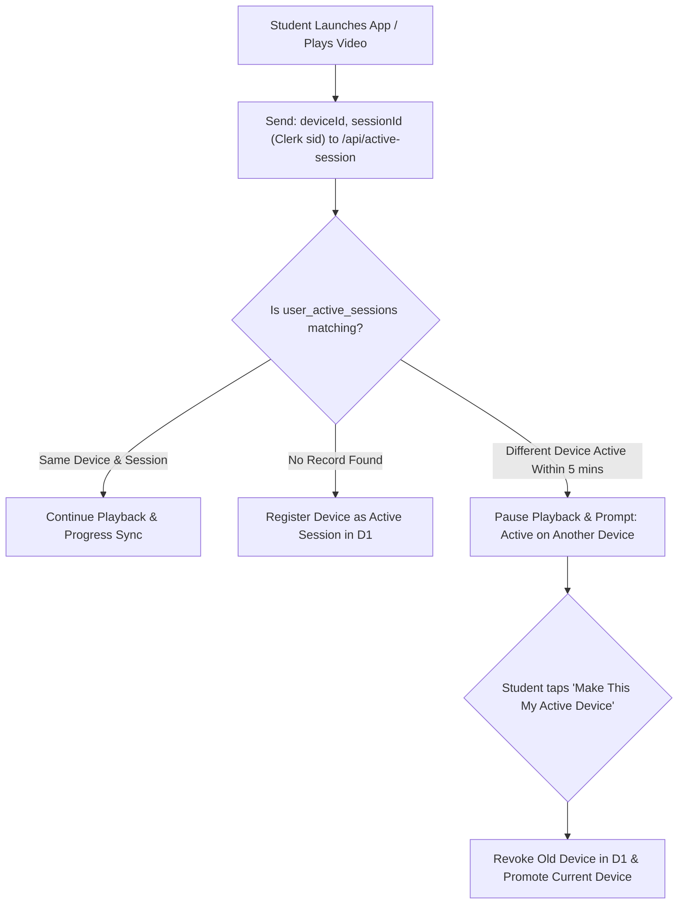

# 🔐 Clerk Authentication Integration Plan

**Target:** Aspirin LMS Flutter Mobile Application (Android) & Cloudflare Workers Edge API  
**Auth Provider:** Clerk (`@clerk/backend` on Edge Worker, `clerk_flutter` / `clerk_auth` on Flutter Android)  
**Objective:** Provide secure, frictionless student authentication with Google One-Tap, Email/Phone OTP, networkless edge JWT verification, and 1-device active session enforcement.

---

## 1. Authentication Architecture Overview

```mermaid
sequenceDiagram
    autonumber
    actor Student as Student (Flutter Android)
    participant Clerk as Clerk Auth Service (clerk.com)
    participant Local as Local Keystore & Drift DB
    participant Edge as Cloudflare Worker Edge API
    participant D1 as Cloudflare D1 Database

    rect rgb(20, 30, 45)
    note over Student, Clerk: 1. Student Sign-In Flow
    Student->>Clerk: Sign In (Email OTP / Google OAuth)
    Clerk-->>Student: Issue Session JWT + Refresh Token
    Student->>Local: Save session token to Android KeyStore (flutter_secure_storage)
    Student->>Local: Update local Drift DB active userId
    end

    rect rgb(25, 40, 30)
    note over Student, D1: 2. Authenticated Edge Requests
    Student->>Edge: GET /api/subjects (Header: Authorization: Bearer <Clerk JWT>)
    Edge->>Edge: verifyToken(token, { jwtKey: CLERK_JWT_KEY }) [Networkless < 1ms]
    Edge->>D1: Query user progress & verify 1-device session policy
    D1-->>Edge: User subjects & completed topic stats
    Edge-->>Student: HTTP 200 OK + User-specific syllabus progress
    end
```



---

## 2. Key Architecture Decisions

### 2.1 Networkless Edge Verification on Cloudflare Workers
* Instead of calling Clerk's API servers on every student request (which adds 150ms–300ms of external network latency), the Cloudflare Worker uses **networkless JWT verification** via `@clerk/backend`:
  ```typescript
  import { verifyToken } from '@clerk/backend';

  const verified = await verifyToken(token, {
    jwtKey: c.env.CLERK_JWT_KEY, // RSA Public Key from Clerk Dashboard
    secretKey: c.env.CLERK_SECRET_KEY,
  });

  const userId = verified.sub;
  const sessionId = (verified as any).sid;
  ```
* **Performance Gain:** Verifying the cryptographic signature in V8 isolate memory takes **< 1 millisecond**, consuming zero external API quotas.

### 2.2 Dual-Layer UI Architecture (Anti-Slop Compliant)
* Rather than rendering generic out-of-the-box Clerk webview modals, the app utilizes `clerk_flutter` / `clerk_auth` for the underlying auth state engine while presenting a **custom medical login interface** built with the Aspirin Design System:
  * Styled in **Marrow Teal** (`#00A389`) or **PrepLadder Indigo** (`#6366F1`).
  * Minimalist, distraction-free OTP input boxes.
  * Native Google One-Tap button.
  * Adheres strictly to [**`docs/ANTI_SLOP_DESIGN_GUIDELINES.md`**](file:///d:/Development/projects/Yui/docs/ANTI_SLOP_DESIGN_GUIDELINES.md) (no purple gradients, no sparkle icons, no generic cartoon illustrations).

### 2.3 Guest-to-User Local Progress Migration
* Students can open the app and sample introductory lectures as `aspirin_guest` without signing in.
* When the student subsequently signs in or registers via Clerk, the local Drift SQLite database automatically runs a migration query:
  ```sql
  UPDATE user_progress SET user_id = :clerkUserId WHERE user_id = 'aspirin_guest';
  UPDATE user_notes SET user_id = :clerkUserId WHERE user_id = 'aspirin_guest';
  ```
  This guarantees that zero watch progress or personal annotations are lost upon account creation.

---

## 3. Flutter Client Implementation

### 3.1 Dependencies
In `pubspec.yaml`:
```yaml
dependencies:
  clerk_flutter: ^0.0.18-beta
  flutter_secure_storage: ^9.2.2
  dio: ^5.6.0
  flutter_riverpod: ^2.5.1
```

### 3.2 Root Clerk Initialization
```dart
import 'package:flutter/material.dart';
import 'package:clerk_flutter/clerk_flutter.dart';
import 'package:flutter_riverpod/flutter_riverpod.dart';

void main() async {
  WidgetsFlutterBinding.ensureInitialized();

  const clerkPublishableKey = String.fromEnvironment(
    'CLERK_PUBLISHABLE_KEY',
    defaultValue: 'pk_test_...',
  );

  runApp(
    ProviderScope(
      child: ClerkAuth(
        config: const ClerkAuthConfig(
          publishableKey: clerkPublishableKey,
        ),
        child: const AspirinApp(),
      ),
    ),
  );
}
```

---

### 3.3 Dio Authentication Interceptor (`ClerkAuthInterceptor`)
Automatically attaches the Clerk session token to every outgoing request to the Cloudflare API, and handles automatic token renewal:

```dart
import 'package:dio/dio.dart';
import 'package:clerk_flutter/clerk_flutter.dart';

class ClerkAuthInterceptor extends Interceptor {
  final ClerkAuth auth;

  ClerkAuthInterceptor({required this.auth});

  @override
  Future<void> onRequest(
    RequestOptions options,
    RequestInterceptorHandler handler,
  ) async {
    try {
      // 1. Fetch active session token from Clerk engine
      final sessionToken = await auth.sessionToken();
      if (sessionToken != null && sessionToken.jwt.isNotEmpty) {
        options.headers['Authorization'] = 'Bearer ${sessionToken.jwt}';
      }
    } catch (e) {
      // Offline fallback: request continues as guest or with cached token
    }

    return handler.next(options);
  }

  @override
  void onError(DioException err, ErrorInterceptorHandler handler) {
    if (err.response?.statusCode == 401) {
      // Session expired or revoked: notify Riverpod auth provider
    }
    return handler.next(err);
  }
}
```

---

### 3.4 Riverpod Auth State Controller
```dart
import 'package:riverpod_annotation/riverpod_annotation.dart';
import 'package:clerk_flutter/clerk_flutter.dart';

part 'auth_provider.g.dart';

class AuthState {
  final bool isAuthenticated;
  final String userId;
  final String? email;
  final String? fullName;

  const AuthState({
    required this.isAuthenticated,
    required this.userId,
    this.email,
    this.fullName,
  });

  static const guest = AuthState(
    isAuthenticated: false,
    userId: 'aspirin_guest',
  );
}

@riverpod
class AuthNotifier extends _$AuthNotifier {
  @override
  AuthState build() {
    return AuthState.guest;
  }

  void updateFromClerk(User? user) {
    if (user == null) {
      state = AuthState.guest;
    } else {
      state = AuthState(
        isAuthenticated: true,
        userId: user.id,
        email: user.emailAddresses.firstOrNull?.emailAddress,
        fullName: '${user.firstName ?? ''} ${user.lastName ?? ''}'.trim(),
      );
    }
  }

  Future<void> signOut(ClerkAuth clerkAuth) async {
    await clerkAuth.signOut();
    state = AuthState.guest;
  }
}
```

---

## 4. 1-Device Active Session Policy (Anti-Account Sharing)

Medical students frequently share credentials across batches. Aspirin LMS prevents account sharing while remaining seamless for single users:



### Edge Worker Verification in Cloudflare D1
```typescript
app.post('/active-session', async (c) => {
  const db = c.env.DB;
  const auth = await authenticateUser(c);
  if (!auth) return c.json({ error: 'Unauthorized' }, 401);

  const { deviceId, deviceName, forceSwitch } = await c.req.json();
  const userId = auth.userId;
  const sessionId = auth.sessionId || 'session_default';

  const existing: any = await db
    .prepare('SELECT * FROM user_active_sessions WHERE user_id = ?')
    .bind(userId)
    .first();

  if (existing && existing.device_id !== deviceId && !forceSwitch) {
    const lastActive = new Date(existing.last_heartbeat).getTime();
    const fiveMinutesAgo = Date.now() - 5 * 60 * 1000;

    // If another device was active recently, alert the user
    if (lastActive > fiveMinutesAgo) {
      return c.json({
        conflict: true,
        activeDeviceName: existing.device_name || 'Another Android Device',
        message: 'Your account is currently active on another device.',
      }, 409);
    }
  }

  // Register or update active session
  await db
    .prepare(`
      INSERT INTO user_active_sessions (user_id, session_id, device_id, device_name, last_heartbeat)
      VALUES (?, ?, ?, ?, datetime('now'))
      ON CONFLICT(user_id) DO UPDATE SET
        session_id = ?,
        device_id = ?,
        device_name = ?,
        last_heartbeat = datetime('now')
    `)
    .bind(userId, sessionId, deviceId, deviceName, sessionId, deviceId, deviceName)
    .run();

  return c.json({ success: true });
});
```

---

## 5. Active Project Credentials & Configuration Map

The production and development Clerk credentials discovered in `.dev.vars` and `.env` are configured as follows:

| Environment Variable | Configured Value in Project | Scope |
| :--- | :--- | :--- |
| **`CLERK_PUBLISHABLE_KEY`** | `pk_test_Y2VudHJhbC1mb3gtMjExNy5jbGVyay5hY2NvdW50cy5kZXYk` | Flutter Client & Web App (`VITE_CLERK_PUBLISHABLE_KEY`) |
| **`CLERK_INSTANCE_DOMAIN`** | `central-fox-2117.clerk.accounts.dev` | Clerk Accounts Frontend API & Redirects |
| **`CLERK_SECRET_KEY`** | `sk_test_rDQvd5iXCs43605n1dFfW1U2EKs0gCe9of6IcL7m3F` | Cloudflare Workers Edge Backend (`.dev.vars`) |
| **`CLERK_JWT_KEY`** | RSA 2048-bit Public Key (`MIIBIjANBgkqhkiG9w0BAQEFAAOCAQ8AMIIBCg...`) | Networkless Edge Verification on Cloudflare Workers |
| **`ADMIN_EMAILS`** | `www.sain1919@gmail.com, sain1919@gmail.com` | Verified Administrator Allowlist |
| **`CLOUDFLARE_D1_DB_ID`** | `0f671e86-6451-4d48-87fd-11a06d5cc89a` (`yui-db`) | Cloudflare D1 Database Binding in `wrangler.jsonc` |

### 5.1 Flutter Client Launch Commands
To run the Flutter application with these active credentials:

#### Local Development (Connected to Local Cloudflare Pages Dev Server `http://127.0.0.1:8788`):
```powershell
flutter run --dart-define=CLERK_PUBLISHABLE_KEY=pk_test_Y2VudHJhbC1mb3gtMjExNy5jbGVyay5hY2NvdW50cy5kZXYk --dart-define=API_BASE_URL=http://10.0.2.2:8788/api
```
*(Note: Android emulator uses `10.0.2.2` to access host PC's `127.0.0.1:8788`)*

#### Production Edge (Connected to Live Cloudflare Edge CDN):
```powershell
flutter run --release --dart-define=CLERK_PUBLISHABLE_KEY=pk_test_Y2VudHJhbC1mb3gtMjExNy5jbGVyay5hY2NvdW50cy5kZXYk --dart-define=API_BASE_URL=https://aspirin-lms.pages.dev/api
```

### 5.2 VS Code Launch Configuration (`.vscode/launch.json`)
```json
{
  "version": "0.2.0",
  "configurations": [
    {
      "name": "Aspirin LMS (Dev Edge)",
      "request": "launch",
      "type": "dart",
      "args": [
        "--dart-define=CLERK_PUBLISHABLE_KEY=pk_test_Y2VudHJhbC1mb3gtMjExNy5jbGVyay5hY2NvdW50cy5kZXYk",
        "--dart-define=API_BASE_URL=http://10.0.2.2:8788/api"
      ]
    },
    {
      "name": "Aspirin LMS (Production)",
      "request": "launch",
      "type": "dart",
      "args": [
        "--dart-define=CLERK_PUBLISHABLE_KEY=pk_test_Y2VudHJhbC1mb3gtMjExNy5jbGVyay5hY2NvdW50cy5kZXYk",
        "--dart-define=API_BASE_URL=https://aspirin-lms.pages.dev/api"
      ]
    }
  ]
}
```

---

## 6. Implementation Milestones

1. **Step 1:** Add `clerk_flutter` and `flutter_secure_storage` to Flutter app `pubspec.yaml`.
2. **Step 2:** Wrap app root in `ClerkAuth` with the configured `CLERK_PUBLISHABLE_KEY`.
3. **Step 3:** Wire `ClerkAuthInterceptor` in the Dio networking client to automatically inject `Authorization: Bearer <sessionToken.jwt>`.
4. **Step 4:** Implement custom medical sign-in screen (Email OTP and Google One-Tap) in Marrow Teal / PrepLadder Indigo styling.
5. **Step 5:** Wire the guest-to-user Drift database migration on successful login.
6. **Step 6:** Validate networkless token verification in Cloudflare Worker `functions/api/[[route]].ts` using the active `CLERK_JWT_KEY`.
