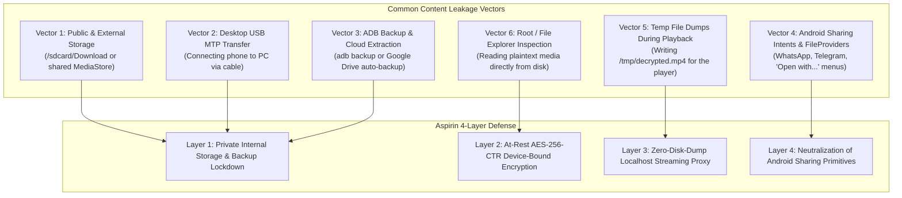

# 🔒 Content Leakage Prevention: Local Download Isolation Architecture

**Target:** Aspirin LMS Flutter Mobile Application (Android)  
**Objective:** Guarantee that downloaded video lectures (MP4) and clinical review notes (PDF) remain 100% confined within the application, strictly unshareable, and inaccessible to external apps, file managers, USB transfers, or device exports.  
**Scope Note:** As requested, this blueprint focuses exclusively on **storage sandboxing, at-rest encryption, zero-disk-dump decryption, and sharing neutralization**. Advanced display watermarks and screen capture blocking are intentionally out of scope.

---

## 1. Threat Model & Leakage Attack Vectors

In standard mobile development, naive implementations of file downloading store raw media in accessible device storage or leak plaintext files during playback. The following attack vectors must be neutralized:



---

## 2. The 4-Layer Content Isolation Architecture

### 🛡️ Layer 1: Private Internal Sandboxing & Android Backup Lockdown
* **Storage Location:** All media files are stored exclusively in internal app-private storage:
  `context.noBackupFilesDir` or `context.filesDir + '/app_flutter/vault/'`.
  * External storage (`/sdcard/`, `getExternalStorageDirectory()`, `MediaStore`) is **strictly forbidden**.
  * Internal storage is protected by Linux Kernel UID isolation: third-party file managers, photo viewers, and WhatsApp cannot read this directory.
* **MTP USB Transfer Isolation:** Android does **not** expose internal `/data/user/0/<package>/` over MTP (Media Transfer Protocol). When a user plugs their phone into a Windows/Mac PC via USB, downloaded files do not appear in the file explorer.
* **ADB & Cloud Backup Disablement:**
  In `android/app/src/main/AndroidManifest.xml`:
  ```xml
  <application
      android:allowBackup="false"
      android:fullBackupContent="false"
      android:hasFragileUserData="false"
      ... >
  ```
  This prevents users from extracting the private app directory using `adb backup -f backup.ab com.aspirin.lms` or Google Cloud Auto-Backup.
* **Media Scanner Suppression:** A `.nomedia` file is placed at the root of the vault directory.

---

### 🛡️ Layer 2: At-Rest AES-256-CTR Device-Bound Cryptographic Shield

Even if a student uses a rooted device or custom recovery to inspect `/data/user/0/com.aspirin.lms/`, the raw files on disk are **cryptographically illegible random bytes**.

#### Why AES-CTR (Counter Mode) is the Only Viable Media Cipher:
* Standard block ciphers like **AES-CBC** require sequential decryption from byte zero. In a 750 MB video lecture, seeking to minute 35 (byte offset 400 MB) would require decrypting the preceding 400 MB, causing huge playback lag or Out-Of-Memory (OOM) crashes.
* **AES-CTR turns a block cipher into a stream cipher**, enabling **$O(1)$ random-access seek times**:
  $$\text{Effective Counter} = \text{Initial Nonce} + \left\lfloor \frac{\text{Byte Offset}}{16} \right\rfloor$$
  To decrypt bytes `400,000,000` to `400,131,072` (a 128 KB buffer for the player), the cipher calculates the exact counter block and decrypts only that single slice in under 2 milliseconds.

#### Key Generation & Hardware Keystore Binding:
* The 256-bit Master Encryption Key (MEK) is generated cryptographically on the device upon first launch.
* The key is stored in the **hardware-backed Android KeyStore** (TEE/StrongBox) via `flutter_secure_storage`:
  ```dart
  final storage = FlutterSecureStorage(
    aOptions: const AndroidOptions(
      keyCipherAlgorithm: KeyCipherAlgorithm.RSA_ECB_OAEPwithSHA_256andMGF1Padding,
      storageCipherAlgorithm: StorageCipherAlgorithm.AES_GCM_NoPadding,
      resetOnError: true,
    ),
  );
  ```
* Because the key is physically tied to the device's secure enclave, copying an encrypted `.aspirin` file to another phone or PC produces unusable garbage.

#### Obfuscated File Container Format (`.aspirin`):
Downloaded files do not use standard extensions (`.mp4`, `.pdf`) or standard headers (`ftyp`, `%PDF-`):

```
┌─────────────────┬─────────────────┬─────────────────┬───────────────────────────────┐
│ Magic Identifier│ Nonce / IV      │ Key Integrity   │ Ciphertext Payload            │
│ "ASPR" (4 bytes)│ (16 bytes)      │ Tag (16 bytes)  │ (AES-256-CTR Encrypted Stream)│
└─────────────────┴─────────────────┴─────────────────┴───────────────────────────────┘
```

---

### 🛡️ Layer 3: Zero-Disk-Dump Streaming Decryption (Localhost Loopback Proxy)

A critical vulnerability in poorly designed offline apps is decrypting files to a temporary plaintext file (`/tmp/video.mp4`) before passing it to the media player. Plaintext temp files can be easily intercepted, copied, or recovered.

**Aspirin LMS eliminates temp files completely:**

```mermaid
sequenceDiagram
    autonumber
    actor Player as media_kit Player
    participant Proxy as In-App Localhost HTTP Server (127.0.0.1:port)
    participant Engine as AES-CTR Decryption Engine
    participant Disk as Internal Encrypted Vault (*.aspirin)

    rect rgb(20, 30, 45)
    note over Player, Disk: In-Memory On-The-Fly Decryption (Zero Disk Plaintext)
    Player->>Proxy: GET /vault/topic_042?token=xyz (Range: bytes=1048576-2097151)
    Proxy->>Proxy: Validate short-lived ephemeral session token
    Proxy->>Disk: Read 1 MB encrypted slice from disk (RandomAccessFile)
    Disk-->>Proxy: Encrypted bytes
    Proxy->>Engine: Decrypt slice with Counter = IV + (1048576 / 16)
    Engine-->>Proxy: Decrypted plaintext buffer in volatile RAM (64KB chunks)
    Proxy-->>Player: HTTP 206 Partial Content (streams directly into media_kit memory)
    end
```



#### 1. For Video Playback (`media_kit`):
1. An internal Dart `HttpServer` binds to loopback `127.0.0.1` on a random ephemeral port.
2. The player receives a localhost URL: `http://127.0.0.1:<port>/play/<topicId>?token=<ephemeral_token>`.
3. When `media_kit` requests byte ranges, the proxy reads the encrypted slice from disk, decrypts the bytes in volatile RAM, and streams them as `HTTP 206 Partial Content`.
4. Plaintext data exists **only** in temporary RAM buffers and is never written to disk.

#### 2. For Clinical Notes (`pdfrx`):
1. The note reader reads the encrypted `.aspirin` file from disk.
2. Decrypts the bytes in-memory into a `Uint8List` buffer.
3. Opens the document directly in PDFium using `PdfDocument.openData(decryptedBytes)`.
4. The memory is garbage collected when the student exits the reader, leaving zero residual files.

---

### 🛡️ Layer 4: Neutralization of Android Sharing Primitives

To ensure downloaded content cannot be exported via system menus:

1. **Zero `FileProvider` Exposure:**
   * No `FileProvider` or `<paths>` tags are registered in `AndroidManifest.xml` for the vault folder.
   * Android will refuse to generate `content://` URIs for any file in the vault, making it impossible for other apps to receive read permissions.
2. **Elimination of Share Intents:**
   * No `Share.shareXFiles`, `ACTION_SEND`, or `ACTION_SEND_MULTIPLE` intents exist in the codebase for downloaded lectures or notes.
3. **Internal Viewer Enforcement:**
   * No "Open with..." or `ACTION_VIEW` intents. All PDFs open exclusively in the in-app `pdfrx` viewer, and all videos play exclusively in the in-app `media_kit` player.
4. **App Uninstall Wipe:**
   * Because files reside in internal `noBackupFilesDir`, Android automatically deletes the entire vault when the student uninstalls the app.

---

## 3. Concrete Implementation Blueprint

### 3.1 AES-CTR Random-Access Decryption Engine
```dart
import 'dart:io';
import 'dart:typed_data';
import 'package:pointycastle/export.dart';

class AspirinCipherEngine {
  static const int headerSize = 36; // 4 bytes magic + 16 bytes IV + 16 bytes tag
  static const String magicHeader = 'ASPR';

  final Uint8List masterKey; // 256-bit AES key from KeyStore

  AspirinCipherEngine({required this.masterKey});

  /// Decrypts an arbitrary byte range from an encrypted file on disk
  Future<Uint8List> decryptByteRange({
    required File encryptedFile,
    required int rangeStart,
    required int rangeLength,
  }) async {
    final raf = await encryptedFile.open(mode: FileMode.read);
    try {
      // 1. Read IV from file header
      await raf.setPosition(4);
      final iv = await raf.read(16);

      // 2. Calculate AES-CTR counter block offset
      final int startBlock = rangeStart ~/ 16;
      final int blockOffset = rangeStart % 16;
      final int totalBytesToRead = blockOffset + rangeLength;

      // 3. Read encrypted slice from disk
      await raf.setPosition(headerSize + (startBlock * 16));
      final encryptedBytes = await raf.read(totalBytesToRead);

      // 4. Initialize CTR cipher at the calculated block offset
      final effectiveIv = _incrementCounter(iv, startBlock);
      final cipher = CTRStreamCipher(AESEngine())
        ..init(false, ParametersWithIV(KeyParameter(masterKey), effectiveIv));

      final decryptedBytes = Uint8List(encryptedBytes.length);
      cipher.processBytes(encryptedBytes, 0, encryptedBytes.length, decryptedBytes, 0);

      // 5. Slice and return the exact requested byte range
      return decryptedBytes.sublist(blockOffset, blockOffset + rangeLength);
    } finally {
      await raf.close();
    }
  }

  Uint8List _incrementCounter(Uint8List baseIv, int counterIncrement) {
    final counter = Uint8List.fromList(baseIv);
    int carry = counterIncrement;
    for (int i = 15; i >= 0 && carry > 0; i--) {
      final int sum = counter[i] + (carry & 0xFF);
      counter[i] = sum & 0xFF;
      carry = (carry >> 8) + (sum >> 8);
    }
    return counter;
  }
}
```

---

### 3.2 Localhost Streaming Proxy for `media_kit`
```dart
import 'dart:io';
import 'dart:typed_data';

class LocalhostStreamingProxy {
  HttpServer? _server;
  final AspirinCipherEngine cipherEngine;
  final Map<String, File> _activeMediaFiles = {};
  String? _sessionToken;

  LocalhostStreamingProxy({required this.cipherEngine});

  Future<int> start() async {
    // Bind to loopback interface on a random ephemeral port
    _server = await HttpServer.bind(InternetAddress.loopbackIPv4, 0);
    _server!.listen(_handleRequest);
    return _server!.port;
  }

  String registerPlaybackSource(String topicId, File encryptedFile) {
    _sessionToken = _generateRandomToken();
    _activeMediaFiles[_sessionToken!] = encryptedFile;
    return 'http://127.0.0.1:${_server!.port}/stream/$_sessionToken';
  }

  Future<void> _handleRequest(HttpRequest request) async {
    final token = request.uri.pathSegments.last;
    final file = _activeMediaFiles[token];

    if (file == null || !file.existsSync()) {
      request.response.statusCode = HttpStatus.notFound;
      await request.response.close();
      return;
    }

    final totalCipherSize = await file.length();
    final totalPlaintextSize = totalCipherSize - AspirinCipherEngine.headerSize;

    // Handle Range Requests (HTTP 206)
    final rangeHeader = request.headers.value(HttpHeaders.rangeHeader);
    int start = 0;
    int end = totalPlaintextSize - 1;

    if (rangeHeader != null && rangeHeader.startsWith('bytes=')) {
      final parts = rangeHeader.substring(6).split('-');
      start = int.parse(parts[0]);
      if (parts.length > 1 && parts[1].isNotEmpty) {
        end = int.parse(parts[1]);
      }
    }

    final chunkLength = end - start + 1;

    // Decrypt the requested chunk on-the-fly in RAM
    final decryptedBytes = await cipherEngine.decryptByteRange(
      encryptedFile: file,
      rangeStart: start,
      rangeLength: chunkLength,
    );

    request.response.statusCode = HttpStatus.partialContent;
    request.response.headers.set(HttpHeaders.contentTypeHeader, 'video/mp4');
    request.response.headers.set(HttpHeaders.acceptRangesHeader, 'bytes');
    request.response.headers.set(HttpHeaders.contentRangeHeader, 'bytes $start-$end/$totalPlaintextSize');
    request.response.headers.set(HttpHeaders.contentLengthHeader, chunkLength.toString());

    request.response.add(decryptedBytes);
    await request.response.close();
  }

  void stop() {
    _server?.close(force: true);
    _activeMediaFiles.clear();
  }

  String _generateRandomToken() => DateTime.now().microsecondsSinceEpoch.toString();
}
```

---

## 4. Verification & Penetration Testing Checklist

To verify that content leakage is 100% prevented, the app must pass the following manual security tests on physical Android test devices:

| Test Scenario | Procedure | Expected Secure Result |
| :--- | :--- | :--- |
| **1. File Manager Audit** | Install Google Files, Solid Explorer, or Mi File Manager. Scan internal and external storage. | 0 video or PDF files appear. No media files indexed. |
| **2. USB MTP PC Check** | Connect the phone to a Windows PC via USB cable. Set USB mode to "File Transfer". | `/data/` is invisible. No Aspirin files appear in device explorer. |
| **3. ADB Backup Attack** | Run `adb backup -f leak_test.ab com.aspirin.lms` via terminal. | Fails or generates a 0-byte backup because `allowBackup="false"`. |
| **4. Raw Disk Extraction (Root)** | On a rooted device, pull `/data/user/0/com.aspirin.lms/no_backup/vault/*.aspirin` to a PC and open in VLC. | VLC fails to parse file; file inspection reveals high-entropy AES ciphertext. |
| **5. Temp File Audit** | While playing a 500 MB video, monitor the device file system for temporary files. | 0 plaintext bytes created on disk. Localhost streams directly to RAM. |
| **6. Share Sheet Inspection** | Long-press or inspect any video or note item in the UI. | No "Share", "Export", or "Send to" buttons exist in the app. |
