# 📚 Curriculum & Taxonomy: 19 MBBS Subjects & Platform Matrix

This document defines the medical academic hierarchy, subject distribution, platform catalogs, and faculty tracks implemented in the Aspirin LMS Flutter application.

---

## 1. NMC 19 MBBS Subjects & University Prof Classification

Under the National Medical Commission (NMC) Competency-Based Medical Education (CBME) curriculum, the medical undergraduate syllabus is categorized into four professional examination phases:

```mermaid
graph TD
    NMC["NMC 19 MBBS Subjects"] --> P1["1st Prof (Pre-Clinical)<br/>3 Subjects • Foundation"]
    NMC --> P2["2nd Prof (Para-Clinical)<br/>4 Subjects • Pathology & Therapeutics"]
    NMC --> P3["3rd Prof Part 1 (Minor Clinical)<br/>3 Subjects • Head & Neck + Social"]
    NMC --> P4["Final Prof Part 2 (Major Clinical)<br/>9 Subjects • Medicine, Surgery, Allied"]

    P1 --> S1["Anatomy"]
    P1 --> S2["Physiology"]
    P1 --> S3["Biochemistry"]

    P2 --> S4["Pathology"]
    P2 --> S5["Pharmacology"]
    P2 --> S6["Microbiology"]
    P2 --> S7["Forensic Medicine & Toxicology (FMT)"]

    P3 --> S8["Community Medicine (PSM)"]
    P3 --> S9["Ophthalmology"]
    P3 --> S10["ENT (Otorhinolaryngology)"]

    P4 --> S11["General Medicine"]
    P4 --> S12["General Surgery"]
    P4 --> S13["Obstetrics & Gynecology (OBG)"]
    P4 --> S14["Pediatrics"]
    P4 --> S15["Orthopedics"]
    P4 --> S16["Dermatology"]
    P4 --> S17["Psychiatry"]
    P4 --> S18["Radiology"]
    P4 --> S19["Anesthesiology"]
```



---

## 2. Detailed Subject Breakdown & Metrics

| # | Subject Name | Code | Prof Phase | Category | Modules (Avg) | Total Lectures | Total Notes | Core Topics / Systems |
| :---: | :--- | :--- | :--- | :--- | :---: | :---: | :---: | :--- |
| **1** | **Anatomy** | `ANAT` | 1st Prof | Pre-Clinical | 14 | 142 | 18 | Gross Anatomy, Neuroanatomy, Embryology, Histology, Genetics |
| **2** | **Physiology** | `PHYS` | 1st Prof | Pre-Clinical | 11 | 98 | 12 | General, Nerve-Muscle, CVS, Respi, Renal, Endocrine, Neuro |
| **3** | **Biochemistry** | `BIOC` | 1st Prof | Pre-Clinical | 9 | 76 | 10 | Carbohydrates, Lipids, Proteins, Molecular Bio, Nutrition, Metabolism |
| **4** | **Pathology** | `PATH` | 2nd Prof | Para-Clinical | 16 | 164 | 22 | General Pathology, Hematology, Systemic Pathology, Clinical Path |
| **5** | **Pharmacology** | `PHAR` | 2nd Prof | Para-Clinical | 13 | 128 | 16 | General Pharma, ANS, CVS, CNS, Antimicrobials, Chemotherapy |
| **6** | **Microbiology** | `MICR` | 2nd Prof | Para-Clinical | 10 | 112 | 14 | General, Bacteriology, Virology, Mycology, Parasitology, Immunology |
| **7** | **Forensic Medicine (FMT)** | `FORN` | 2nd Prof | Para-Clinical | 8 | 54 | 8 | Forensic Pathology, Autopsy, Thanatology, Clinical Toxicology |
| **8** | **Community Medicine (PSM)** | `COMM` | 3rd Prof Part 1 | Minor Clinical | 12 | 96 | 14 | Epidemiology, Biostatistics, Health Programs, Demography, Nutrition |
| **9** | **Ophthalmology** | `OPHT` | 3rd Prof Part 1 | Minor Clinical | 9 | 68 | 10 | Optics, Cornea, Cataract, Glaucoma, Retina, Uvea, Neuro-Ophtha |
| **10** | **ENT (Otorhinolaryngology)** | `ENTO` | 3rd Prof Part 1 | Minor Clinical | 8 | 72 | 10 | Otology, Rhinology, Laryngology, Head & Neck Oncology |
| **11** | **General Medicine** | `MED` | Final Prof Part 2 | Major Clinical | 18 | 240 | 32 | Cardiology, Pulmonology, Neurology, Nephrology, GI, Endocrinology |
| **12** | **General Surgery** | `SURG` | Final Prof Part 2 | Major Clinical | 16 | 192 | 26 | GI Surgery, Urology, Breast, Endocrine, Vascular, Trauma & Burns |
| **13** | **Obstetrics & Gynecology (OBG)** | `OBGY` | Final Prof Part 2 | Major Clinical | 14 | 158 | 20 | Antenatal Care, Labor, High-Risk Pregnancy, Gynae-Oncology |
| **14** | **Pediatrics** | `PEDI` | Final Prof Part 2 | Major Clinical | 10 | 88 | 12 | Neonatology, Growth & Development, Pediatric Infections & Disorders |
| **15** | **Orthopedics** | `ORTH` | Final Prof Part 2 | Major Clinical | 7 | 56 | 8 | Traumatology, Fractures, Spine, Joint Diseases, Pediatric Ortho |
| **16** | **Dermatology** | `DERM` | Final Prof Part 2 | Major Clinical | 6 | 46 | 6 | Infections, Papulosquamous, Vesiculobullous, STDs, Leprosy |
| **17** | **Psychiatry** | `PSYC` | Final Prof Part 2 | Major Clinical | 5 | 38 | 6 | Schizophrenia, Mood Disorders, Anxiety, Substance Abuse |
| **18** | **Radiology** | `RADI` | Final Prof Part 2 | Major Clinical | 6 | 48 | 8 | Systemic X-Rays, CT, MRI, Ultrasound, Interventional Radiology |
| **19** | **Anesthesiology** | `ANES` | Final Prof Part 2 | Major Clinical | 5 | 36 | 6 | General Anesthesia, Regional Blocks, Critical Care, CPR & Airway |

---

## 3. Multi-Platform Content Taxonomy

The Aspirin LMS repository organizes content across **four major platforms** stored on Microsoft SharePoint (`5ncjwt.sharepoint.com` and `openmedq.sharepoint.com`):

```
SharePoint: /Shared Documents/Aspirin_LMS/
├── 01_PrepLadder_X_English/     (1,214 verified lectures across 19 subjects)
├── 02_PrepLadder_X_Hinglish/    (1,165 verified lectures across 19 subjects)
├── 03_Cerebellum_Academy/       (1,636 lectures + 24 master textbooks across 22 faculty tracks)
└── 04_Marrow_Edition_6/         (504 verified high-bitrate lectures for final-year clinicals)
```

### 3.1 Platform Profiles

| Platform ID | Display Name | Language | Target Focus | Key Faculty Highlights |
| :--- | :--- | :--- | :--- | :--- |
| `prepx_en` | **PrepLadder Edition X (English)** | English | Comprehensive 19 Subjects | Dr. Rohan Khandelwal, Dr. Rajesh Gubba, Dr. Prasan Vij |
| `prepx_hi` | **PrepLadder Edition X (Hinglish)** | Hinglish | High-Yield Revision | Bilingual explanations for Indian clinical context |
| `marrow` | **Marrow Edition 6** | English | Clinical In-Depth (Final Year) | Surgery, OBG, Pediatrics, Ortho, Derma, Psych, Radio, Anesth |
| `cerebellum` | **Cerebellum Academy** | English/Hindi | Conceptual Mastery & Recall | Dr. Gobind Rai Garg (Pharma), Dr. Sparsh Gupta (Path) |

> ⚠️ **Curriculum Policy Rule:**
> **Marrow Medicine is strictly excluded from Aspirin LMS.** PrepLadder Medicine serves as the single gold-standard master medicine track to prevent duplicated storage and fragmented progress.

---

## 4. Master Clinical Textbooks & PDF Atlases (`notes_pdf`)

Stored in `03_Cerebellum_Academy/00_Notes_PDF/` on SharePoint:

| Subject | Textbook / Note Title | Primary Faculty | File Size | Page Count |
| :--- | :--- | :--- | :---: | :---: |
| **Anatomy** | Clinical Gross & Neuroanatomy Master Atlas | Dr. Shrikant Verma | 955 MB | 420 |
| **Biochemistry** | Clinical Genetics & Metabolic Pathways | Dr. Ankur Jain | 515 MB | 260 |
| **Biochemistry** | High-Yield Rapid Biochemistry Review | Dr. Smily Pruthi | 182 MB | 190 |
| **Pathology** | General & Systemic Pathology Review Atlas | Dr. Sparsh Gupta | 480 MB | 380 |
| **Pharmacology** | Review of Pharmacology with Mnemonics | Dr. Gobind Rai Garg | 410 MB | 340 |
| **Microbiology** | Clinical Microbiology & Parasitology Guide | Dr. Priyanka Sachdev | 390 MB | 310 |
| **Microbiology** | High-Yield Bacteriology & Virology | Dr. Devyani Puri | 320 MB | 280 |
| **Surgery** | Clinical Surgery Pearls & Case Discussions | Dr. Rohan Khandelwal | 620 MB | 440 |
| **Pediatrics** | Essential Clinical Pediatrics Review | Dr. Anand Bhatia | 350 MB | 290 |
| **Radiology** | High-Resolution Imaging & X-Ray Atlas | Dr. Zainab Vora | 580 MB | 360 |

---

## 5. Dart Domain Models for Taxonomy

```dart
enum MBBSProf {
  prof1('1st Prof', 'Pre-Clinical', [SubjectCode.anat, SubjectCode.phys, SubjectCode.bioc]),
  prof2('2nd Prof', 'Para-Clinical', [SubjectCode.path, SubjectCode.phar, SubjectCode.micr, SubjectCode.forn]),
  prof3Part1('3rd Prof Part 1', 'Minor Clinical', [SubjectCode.comm, SubjectCode.opht, SubjectCode.ento]),
  profFinalPart2('Final Prof Part 2', 'Major Clinical', [
    SubjectCode.med, SubjectCode.surg, SubjectCode.obgy, SubjectCode.pedi,
    SubjectCode.orth, SubjectCode.derm, SubjectCode.psyc, SubjectCode.radi, SubjectCode.anes
  ]);

  final String label;
  final String category;
  final List<SubjectCode> subjects;
  const MBBSProf(this.label, this.category, this.subjects);
}

enum PlatformId {
  prepLadderEn('prepx_en', 'PrepLadder Edition X', 'English', '🇬🇧'),
  prepLadderHi('prepx_hi', 'PrepLadder Edition X', 'Hinglish', '🇮🇳'),
  marrowE6('marrow', 'Marrow Edition 6', 'English', '🩺'),
  cerebellum('cerebellum', 'Cerebellum Academy', 'Bilingual', '🎓');

  final String code;
  final String title;
  final String language;
  final String emoji;
  const PlatformId(this.code, this.title, this.language, this.emoji);
}
```
