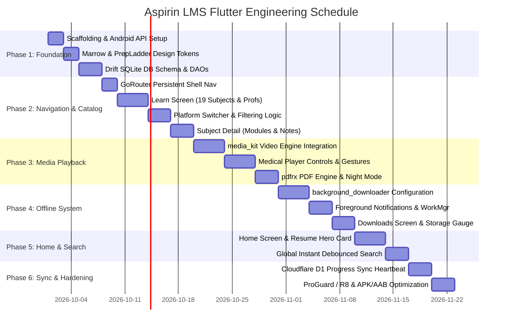

# 🚀 Phase-Wise Implementation Roadmap & Milestones

This document defines the 6-phase engineering plan to construct the Aspirin LMS Flutter Android mobile application from ground up to release readiness.

---

## 1. Roadmap Overview & Timeline

---

## 2. Phase-by-Phase Execution Details

### 🟢 Phase 1: Scaffolding, Design System & Local DB (Week 1)
**Goal:** Establish clean repository foundations, compile-time design tokens, local database, and network bindings.

* **Key Deliverables:**
  1. Flutter project setup targeting Android SDK minimum 26 (Android 8.0) and target 35 (Android 15).
  2. Implement `AspirinTheme`:
     * Marrow Teal (`#00A389`) vs. PrepLadder Indigo (`#6366F1`) dynamic color schemes.
     * OLED pure black (`#000000`) and dark clinical slate (`#0B0F19`) surfaces.
     * Google Fonts (`Plus Jakarta Sans` and `Outfit`) integration.
  3. Local database layer:
     * Drift SQLite schema implementation (`subjects`, `modules`, `topics`, `notes`, `user_progress`, `offline_downloads`).
     * Drift DAOs for fast indexed queries.
  4. Network layer:
     * `Dio` HTTP client configured with base URL, timeout settings, and bearer token interceptors.
* **Exit Criteria:**
  * Clean `flutter test` execution.
  * Local Drift DB initializes, seeds default mock data, and handles queries with zero latency.

---

### 🟢 Phase 2: Shell Navigation & 19 Subjects Catalog (Week 2)
**Goal:** Deliver the complete NMC curriculum navigation with professional phase accordions and platform switching.

* **Key Deliverables:**
  1. `GoRouter` shell route with persistent bottom navigation:
     * Home, Learn, Downloads, Settings tabs.
  2. **Learn Screen Implementation:**
     * 4 NMC Prof collapsible accordions (1st Prof, 2nd Prof, 3rd Prof Part 1, Final Prof Part 2).
     * 19 MBBS Subject cards with custom specialty icons, module counts, and circular progress rings.
  3. **Multi-Platform Toggle:**
     * Segmented pill switcher: `PrepLadder (EN)`, `PrepLadder (HI)`, `Marrow E6`, `Cerebellum`.
     * Toggling instantly filters subject lecture and note counts.
  4. **Subject Detail Screen:**
     * Hero subject banner with overall completion %.
     * Tab 1: Modules list (collapsible accordion with duration badges).
     * Tab 2: Notes list (file sizes, page counts, download state).
* **Exit Criteria:**
  * Fluid 60/120 FPS scrolling across all 19 subjects on physical Android devices.
  * Smooth transition animations between Learn screen and Subject Detail view.

---

### 🟢 Phase 3: High-Yield Media Streaming Engines (Week 3)
**Goal:** Implement hardware-accelerated video streaming (`media_kit`) and heavy clinical textbook rendering (`pdfrx`).

* **Key Deliverables:**
  1. `media_kit` + `media_kit_video` native Android player integration:
     * Connection to Cloudflare Worker `/api/stream/:chatId/:messageId` HTTP 302 endpoint.
     * Seamless stream playback from Microsoft SharePoint Global Azure CDN.
  2. **Custom Medical Player UI:**
     * ±10s double-tap seek on left/right screen quadrants.
     * Vertical swipe gestures: left side for screen brightness, right side for volume.
     * Speed selector: `0.75x`, `1.0x`, `1.25x`, `1.5x`, `1.75x`, `2.0x`, `2.5x` with pitch-correction.
     * Fullscreen landscape auto-rotation.
     * Native Android Picture-in-Picture (PiP) mode.
  3. **Clinical Drawer (Below Video):**
     * Module playlist with auto-play next option.
     * High-Yield Pearls list.
     * Personal timestamped note-taking pinned to video time.
  4. `pdfrx` PDF Viewer Screen:
     * Multi-touch pinch-to-zoom for anatomical atlases up to 950 MB.
     * Inverted dark reading mode.
* **Exit Criteria:**
  * Video starts streaming in under 1.5 seconds on a standard 4G/5G connection.
  * Seeking forward/backward takes less than 300ms without audio desync.

---

### 🟢 Phase 4: Background Downloader & Scoped Offline Storage (Week 4)
**Goal:** Enable robust background downloading of heavy lectures and notes with 100% offline playback.

* **Key Deliverables:**
  1. `background_downloader` integration with native Android `WorkManager` & Foreground Service:
     * Survives screen lock, app task switching, and phone restarts.
  2. **Persistent Android Status Bar Notification:**
     * Displays download progress percentage, live speed gauge (MB/s), and `Pause` / `Cancel` buttons.
  3. **Scoped App Storage Management:**
     * Files saved to `/downloads/videos/*.mp4` and `/downloads/notes/*.pdf`.
     * Automated `.nomedia` generation to prevent gallery pollution.
  4. **Downloads Screen:**
     * Device storage gauge (Free space, Video storage, Notes storage).
     * Subject-wise grouped downloads list with 1-tap delete or batch clear.
  5. **Offline Source Resolution:**
     * Player automatically plays local file if downloaded, without querying the network.
* **Exit Criteria:**
  * A 500 MB video lecture downloads in background while app is killed, and plays seamlessly when re-opened in Airplane Mode.

---

### 🟢 Phase 5: Home Experience & Global Instant Search (Week 5)
**Goal:** Deliver the Home screen "Command Center" with the prominent Marrow-style search bar and instant resume hero card.

* **Key Deliverables:**
  1. **Home Screen Layout:**
     * Daily study streak counter (`🔥 14 Days`) and active platform badge.
     * **"Resume Where I Left" Hero Card:**
       * Dynamic high-res thumbnail preview.
       * Subject & Prof tag, topic title, faculty name.
       * Linear progress indicator (`18m remaining`).
       * **"Resume"** CTA button jumping to exact saved second in the player.
     * "Continue Your Subjects" horizontal progress carousel.
     * "High-Yield Clinical Notes & Atlases" carousel.
  2. **Global Instant Search Modal:**
     * Real-time debounced search (300ms) across 3,950+ topics, 19 subjects, faculty, and clinical pearls.
     * Filter chips: `All`, `Videos Only`, `Notes Only`, `High-Yield Pearls`.
* **Exit Criteria:**
  * Tapping "Resume" starts video playback at the exact saved second within 1 second.
  * Search responds to typing within 50ms without UI frame drops.

---

### 🟢 Phase 6: Cloud Sync, R8/ProGuard Hardening & Release (Week 6)
**Goal:** Cloudflare D1 progress synchronization, security policies, and production Android App Bundle (AAB) release.

* **Key Deliverables:**
  1. **Cloud Progress Synchronization:**
     * 2-minute debounced sync worker pushing `watched_seconds` to `POST /api/progress`.
     * Sync on app pause (`AppLifecycleState.paused`).
  2. **1-Device Active Session Policy:**
     * Heartbeat check against Cloudflare D1 `user_active_sessions`.
  3. **Release Hardening & ProGuard / R8 Rules:**
     * Configure ProGuard rules to keep `media_kit`, `mpv`, and `pdfrx` native JNI symbols intact.
     * App size optimization (split per ABI: `arm64-v8a`, `armeabi-v7a`).
  4. **Quality Assurance:**
     * Automated integration tests for player seek, download queue, and resume flow.
     * Memory leak audit with DevTools during rapid screen switching.
* **Exit Criteria:**
  * Release APK/AAB builds cleanly with R8 minification enabled.
  * Zero crash reports during 3 hours of continuous lecture playback and background downloading.
