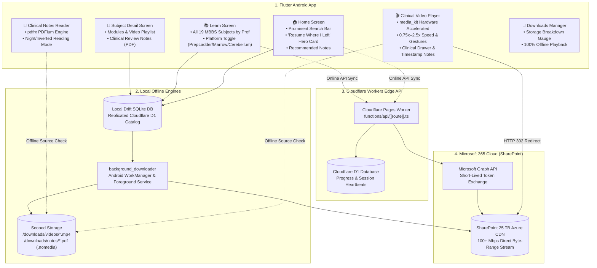

# 📚 Aspirin LMS: Flutter Android App Documentation

Welcome to the technical design and architectural documentation for the **Aspirin LMS Flutter Mobile Application (Android)**.

Aspirin LMS is a high-performance, edge-accelerated Medical Learning Management System designed around the aesthetics and clinical workflows of **Marrow** and **PrepLadder**, streaming and downloading over **3,950+ medical lectures** and **master clinical review textbooks** backed by a **25 TB Microsoft SharePoint Document Library**.

---

## 🗂️ Documentation Index

| Document | Primary Focus | Description |
| :--- | :--- | :--- |
| 📱 [**`FLUTTER_MOBILE_APP_SPEC.md`**](file:///d:/Development/projects/Yui/docs/FLUTTER_MOBILE_APP_SPEC.md) | **Product & UX Specification** | Marrow vs. PrepLadder design tokens, dual-theme engine, screen wireframes, Home ("Resume Where I Left" hero card), Learn screen, and video player UI. |
| 🩺 [**`CURRICULUM_AND_TAXONOMY.md`**](file:///d:/Development/projects/Yui/docs/CURRICULUM_AND_TAXONOMY.md) | **Academic Structure & Content** | Complete 19 MBBS subjects categorized by university prof, multi-platform matrix (PrepLadder EN/HI, Marrow E6, Cerebellum), and master textbooks. |
| ⚡ [**`STREAMING_AND_DOWNLOAD_PIPELINE.md`**](file:///d:/Development/projects/Yui/docs/STREAMING_AND_DOWNLOAD_PIPELINE.md) | **Media & Cloud Infrastructure** | SharePoint 25 TB + Azure CDN byte-range streaming via Cloudflare Workers HTTP 302, background_downloader WorkManager service, and scoped offline storage. |
| 🏗️ [**`TECH_STACK_AND_ARCHITECTURE.md`**](file:///d:/Development/projects/Yui/docs/TECH_STACK_AND_ARCHITECTURE.md) | **Engineering & Code Standards** | Clean Architecture folder structure, Riverpod 2.x AsyncNotifier, Drift SQLite offline database schema, and complete pubspec.yaml dependency registry. |
| 🚀 [**`PHASE_WISE_ROADMAP.md`**](file:///d:/Development/projects/Yui/docs/PHASE_WISE_ROADMAP.md) | **Execution & Milestones** | 6-Phase development schedule from initial scaffolding to Android release hardening, ProGuard rules, and performance audit. |
| 🚫 [**`ANTI_SLOP_DESIGN_GUIDELINES.md`**](file:///d:/Development/projects/Yui/docs/ANTI_SLOP_DESIGN_GUIDELINES.md) | **Quality & Anti-Patterns** | Concrete catalog of banned AI slop patterns (neon glows, em-dashes, glassmorphism overload, generic layouts) and pre-flight audit checklist. |
| 🔒 [**`CONTENT_LEAKAGE_PREVENTION.md`**](file:///d:/Development/projects/Yui/docs/CONTENT_LEAKAGE_PREVENTION.md) | **Offline Security & Anti-Leak** | 4-Layer content isolation architecture: Android private storage, AES-256-CTR encryption, zero-disk-dump localhost streaming, and sharing neutralization. |
| ⚡ [**`PERFORMANCE_AND_FAST_LOADING_SPEC.md`**](file:///d:/Development/projects/Yui/docs/PERFORMANCE_AND_FAST_LOADING_SPEC.md) | **Ultra-Fast Media & Notes** | Sub-400ms TTFF, faststart moov byte 0 optimization, Android MediaCodec HW tuning, and progressive linearized PDF rendering for 950MB textbooks. |
| 🔐 [**`CLERK_AUTH_INTEGRATION.md`**](file:///d:/Development/projects/Yui/docs/CLERK_AUTH_INTEGRATION.md) | **User Management & Edge Auth** | Complete Clerk integration with Flutter SDK, networkless Cloudflare Edge JWT verification (<1ms), 1-device session enforcement, and guest progress migration. |

---

## 🏗️ High-Level System Architecture

---

## 🌟 Quick Feature Matrix

* **Aesthetic Theme:** Dual medical accents (**Marrow Teal** `#00A389` & **PrepLadder Indigo** `#6366F1`) on an ultra-crisp dark slate canvas.
* **19 MBBS Subjects Hierarchy:** Grouped into 1st Prof, 2nd Prof, 3rd Prof Part 1, and Final Prof Part 2.
* **Platform Switcher:** Instantly filter between PrepLadder (English/Hinglish), Marrow Edition 6, and Cerebellum Academy.
* **Zero Egress Streaming:** High-speed streaming directly from Microsoft Azure CDN over HTTP 206 byte-range requests with zero Cloudflare Workers bandwidth consumption.
* **Resilient Background Downloads:** Powered by native Android `WorkManager` and `ForegroundService` with sticky notifications showing real-time MB/s speed.
* **Offline-First Catalog:** Type-safe Drift SQLite database caching the entire curriculum for instant offline browsing in hospital basements or transit.
* **Marrow & PrepLadder Parity:** Full in-scope parity including Audio-Only background playback, 90% auto-completion threshold, persistent speed memory, Marrow Pearls & PrepLadder Treasures drawer, and PiP mode.
