# ⚡ SharePoint Streaming & Background Download Engine

This document details the video streaming architecture, Microsoft SharePoint Azure CDN integration, background download management, and offline-first storage implementation for the Aspirin LMS Flutter Android app.

---

## 1. High-Level Architecture Overview

Video lectures are hosted on **Microsoft SharePoint** across two Microsoft 365 tenants (`5ncjwt.sharepoint.com` and `openmedq.sharepoint.com`). Because medical lectures are large (150 MB to 750 MB each), routing petabytes of video bytes through Cloudflare Workers would incur bandwidth limits and bottleneck throughput.

Instead, Aspirin LMS uses a **Zero-Egress HTTP 302 Redirection Architecture**:

```mermaid
sequenceDiagram
    autonumber
    actor Student as Flutter App (Android)
    participant Edge as Cloudflare Worker (/api/stream/:chat/:msg)
    participant Graph as Microsoft Graph API
    participant CDN as Microsoft Azure CDN (SharePoint)
    participant Storage as App Local Storage & DB (Drift)

    rect rgb(18, 28, 45)
    note over Student, CDN: 1. Live Streaming Flow (media_kit)
    Student->>Edge: GET /api/stream/1003709841202/412
    Edge->>Graph: Exchange OAuth Token & Request @microsoft.graph.downloadUrl
    Graph-->>Edge: Pre-signed Short-Lived Azure CDN Direct Download Link
    Edge-->>Student: HTTP 302 Found (Location: <Azure CDN URL>)
    Student->>CDN: GET with Range: bytes=0-1048575
    CDN-->>Student: HTTP 206 Partial Content (100+ Mbps direct stream)
    Student->>Student: media_kit decodes stream with hardware acceleration
    end

    rect rgb(20, 40, 30)
    note over Student, Storage: 2. Background Download Flow (background_downloader)
    Student->>Storage: Register DownloadTask in Drift DB (Status: queued)
    Student->>Edge: Request Azure CDN URL for direct download
    Edge-->>Student: Direct Azure CDN URL
    Student->>Storage: Start Background Task via WorkManager / Foreground Service
    Storage->>CDN: Direct HTTP 206 chunked download
    CDN-->>Storage: Stream written directly to /downloads/videos/*.mp4
    Storage->>Storage: Place .nomedia to protect Android Gallery
    Storage-->>Student: Task Completed Notification & Update Drift DB
    end
```



---

## 2. Media Streaming Implementation (`media_kit`)

### 2.1 Why `media_kit` Over Standard `video_player`?
* **MPV-Based Native Performance:** Direct native C++ hardware acceleration via FFmpeg/mpv libraries bundled inside `media_kit_libs_android_video`.
* **Zero-Lag Byte-Range Seeking:** Standard ExoPlayer often stalls on high-bitrate MP4 seek jumps over HTTP 302 redirects. `media_kit` handles HTTP 302 and byte-range `Range: bytes=X-Y` requests natively without re-buffering from byte zero.
* **Pitch-Corrected Playback Speeds:** High-yield medical studying requires speeds up to 2.5x. `media_kit` applies `scaletempo2` audio filtering to eliminate high-pitched "chipmunk" distortion.
* **Memory Efficiency:** Releases Android MediaCodec decoders cleanly when switching between lectures.

### 2.2 Flutter Initialization Code
```dart
import 'package:flutter/material.dart';
import 'package:media_kit/media_kit.dart';
import 'package:media_kit_video/media_kit_video.dart';

void initializeMediaEngine() {
  WidgetsFlutterBinding.ensureInitialized();
  MediaKit.ensureInitialized();
}

class AspirinVideoService {
  late final Player player;
  late final VideoController controller;

  AspirinVideoService() {
    player = Player(
      configuration: const PlayerConfiguration(
        bufferSize: 32 * 1024 * 1024, // 32 MB buffer for smooth scrubbing
        logLevel: LogLevel.warning,
      ),
    );
    controller = VideoController(player);
  }

  Future<void> openLecture({
    required String streamUrl,
    required double startPositionSeconds,
  }) async {
    // MediaKit follows HTTP 302 redirects to Azure CDN automatically
    await player.open(
      Media(
        streamUrl,
        httpHeaders: {
          'User-Agent': 'AspirinLMS-Mobile/1.0.0 (Android)',
          'Accept': '*/*',
        },
      ),
      play: true,
    );

    if (startPositionSeconds > 0) {
      await player.seek(Duration(seconds: startPositionSeconds.toInt()));
    }
  }

  void setPlaybackRate(double rate) {
    player.setRate(rate); // 0.75x to 2.5x
  }

  void dispose() {
    player.dispose();
  }
}
```

---

## 3. Background Download Engine (`background_downloader`)

Downloading 200MB–800MB video lectures and 900MB textbooks on mobile connections requires a background service that survives:
1. User navigating away to other apps.
2. Android OS background process termination.
3. Network switching between Wi-Fi and mobile data.

### 3.1 Architecture Components
* **Native WorkManager:** Scheduled persistent background task execution on Android.
* **Foreground Service:** Displays an ongoing notification in the Android status bar, preventing the Android OS low-memory killer (LMK) from terminating the download process.
* **Persistent Notification:** Displays live download rate (e.g. `12.4 MB/s`), percentage progress bar, and interactive `Pause` / `Cancel` actions.

### 3.2 Configuration & Service Implementation
```dart
import 'package:background_downloader/background_downloader.dart';
import 'package:path_provider/path_provider.dart';
import 'dart:io';

class AspirinDownloadManager {
  static final AspirinDownloadManager _instance = AspirinDownloadManager._internal();
  factory AspirinDownloadManager() => _instance;
  AspirinDownloadManager._internal();

  Future<void> init() async {
    await FileDownloader().start(autoCleanDatabase: true);

    // Configure sticky foreground notification for Android
    FileDownloader().configureNotification(
      running: const TaskNotification(
        'Downloading Lecture',
        '{filename} • {progress}% ({networkSpeed})',
      ),
      complete: const TaskNotification(
        'Download Complete',
        '{filename} is ready for offline study.',
      ),
      error: const TaskNotification(
        'Download Failed',
        'Check your connection and tap to retry.',
      ),
      progressBar: true,
      tapOpensFile: false,
    );
  }

  Future<DownloadTask> queueVideoDownload({
    required String topicId,
    required String directDownloadUrl,
    required String filename,
    required String subjectName,
  }) async {
    final appDir = await getApplicationDocumentsDirectory();
    final downloadDir = Directory('${appDir.path}/downloads/videos');
    if (!downloadDir.existsSync()) {
      downloadDir.createSync(recursive: true);
      // Place .nomedia to prevent medical videos appearing in user's gallery
      File('${downloadDir.path}/.nomedia').createSync();
    }

    final task = DownloadTask(
      taskId: topicId,
      url: directDownloadUrl,
      filename: '$topicId.mp4',
      directory: 'downloads/videos',
      baseDirectory: BaseDirectory.applicationDocuments,
      updates: Updates.statusAndProgress,
      retries: 5,
      allowPause: true,
      metaData: subjectName,
      displayName: filename,
    );

    await FileDownloader().enqueue(task);
    return task;
  }
}
```

---

## 4. Scoped Storage & Privacy (`.nomedia`)

Medical lectures often contain graphic surgical procedures, cadaveric dissections, and dermatological lesions. Android's media scanner must be prevented from indexing these into the public gallery.

```
/data/user/0/com.aspirin.lms/app_flutter/
├── downloads/
│   ├── videos/
│   │   ├── .nomedia              <-- Suppresses Android MediaStore indexing
│   │   ├── topic_anat_001.mp4
│   │   └── topic_surg_042.mp4
│   └── notes/
│       ├── .nomedia              <-- Prevents PDF scanner clutter
│       ├── master_anat_atlas.pdf
│       └── pharma_mnemonics.pdf
```

---

## 5. Offline Resolution Strategy

When a student taps "Play Lecture" or "Open Note", the app resolves the media location through a single offline-first repository check:

```dart
Future<String> resolveMediaPlaybackUrl({
  required String topicId,
  required int chatId,
  required int messageId,
}) async {
  final appDir = await getApplicationDocumentsDirectory();
  final localFilePath = '${appDir.path}/downloads/videos/$topicId.mp4';
  final localFile = File(localFilePath);

  // 1. If downloaded file exists and is intact (> 1MB), use local storage immediately
  if (localFile.existsSync() && localFile.lengthSync() > 1024 * 1024) {
    return 'file://$localFilePath';
  }

  // 2. Otherwise, stream from Cloudflare / SharePoint Azure CDN
  final cloudflareApiBase = 'https://aspirin.pages.dev/api';
  return '$cloudflareApiBase/stream/$chatId/$messageId';
}
```

---

## 6. Real-Time Watch Progress & Anti-Account Sharing Sync

1. **Local Drift SQLite Write (Every 5s):** The video player updates `watched_seconds` into the local SQLite database.
2. **Debounced Cloud Sync (Every 2 min & on App Pause):**
   * Endpoint: `POST /api/progress`
   * Payload:
     ```json
     {
       "user_id": "usr_998124",
       "topic_id": "topic_surg_042",
       "watched_seconds": 1245.5,
       "total_seconds": 2530.0,
       "is_completed": 0
     }
     ```
3. **1-Device Active Session Policy:**
   * Periodically validates `session_id` and `device_id` against Cloudflare D1 `user_active_sessions`. If an account is logged into a secondary tablet or phone, playback on the older device is paused with a prompt.
